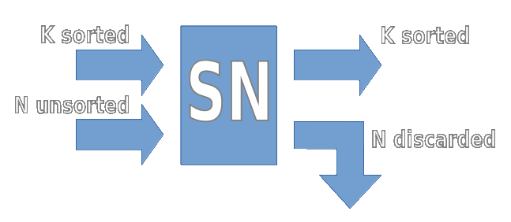
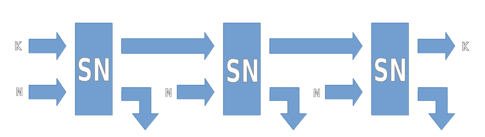
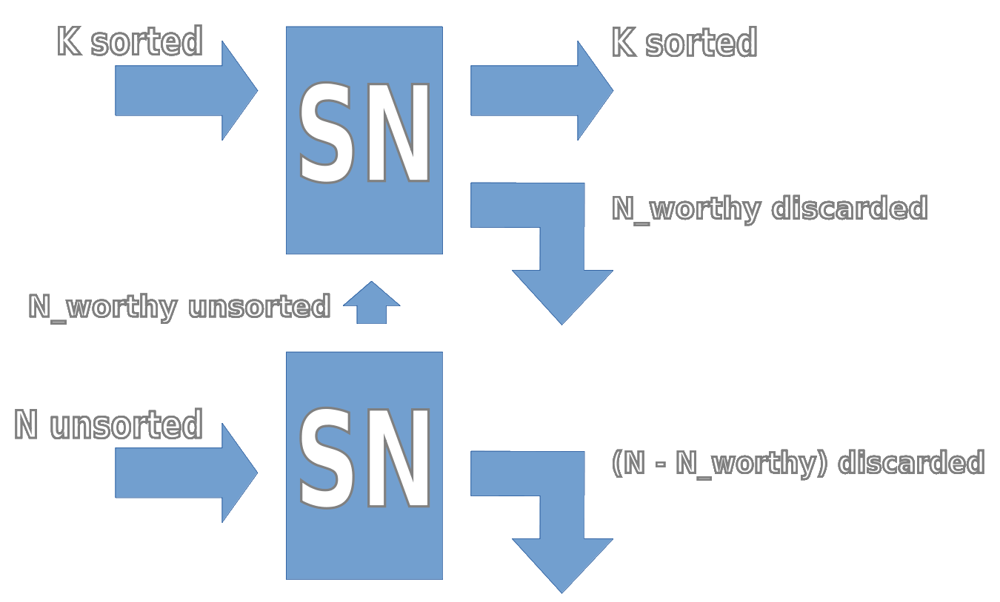
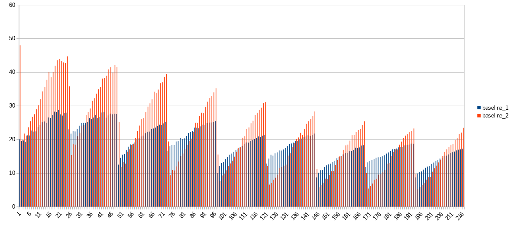
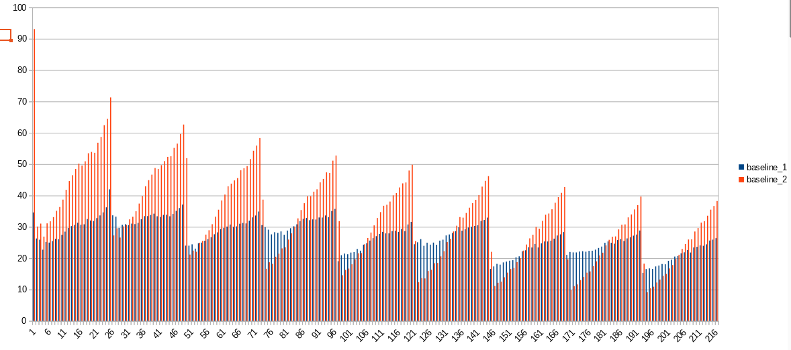
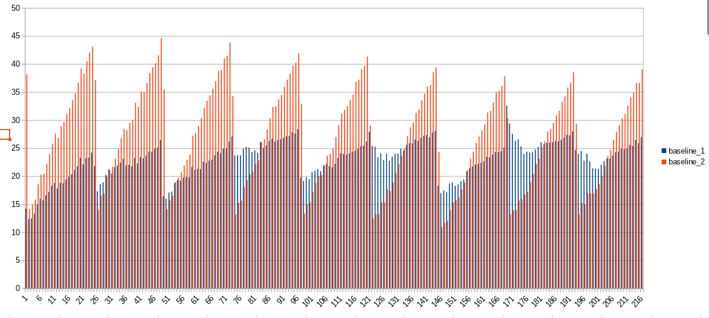
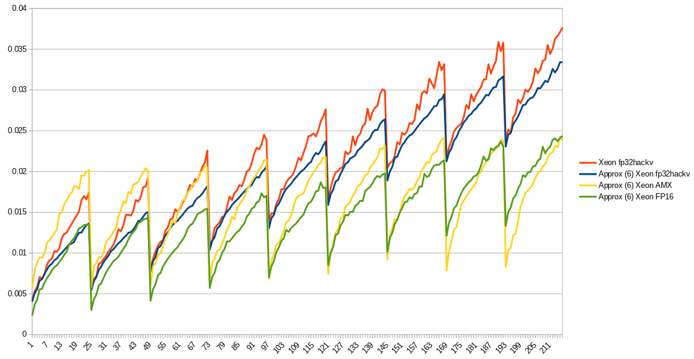
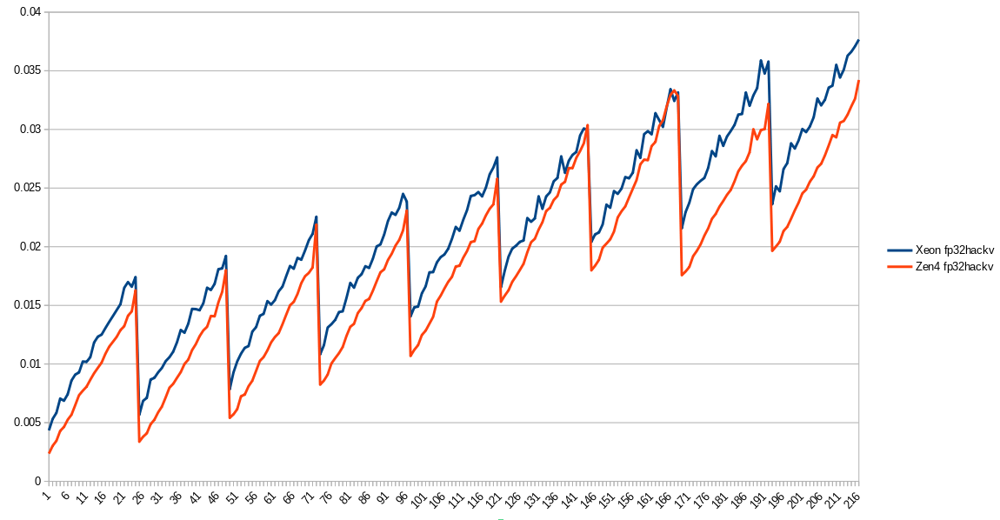
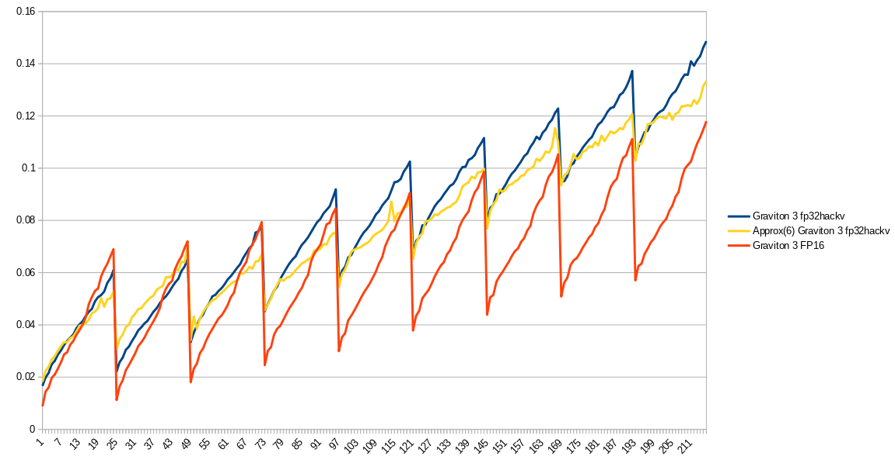

Smalltopk library
===

Smalltopk library is designed to speed up the training for `Product Quantization` and `Product Residual Quantization`.

In this article I'll describe the train of thoughts during the development of this library.

# Similarity search and brute-force search

[//]: # (TODO: QUERY -> QUERIES?)
[//]: # (TODO: N_QUERY -> N_QUERIES?)

The `similarity search` problem in its simplest form can be expressed with the following code:
``` C++
// * data is (n_data, dim), represented as an array of size n_data*dim,
// * query is (n_query, dim), represented as an array of size n_query*dim,
// * distances is (n_query, k), represented as an array of size n_query*k,
// * indices is (n_query, k), represented as an array of size n_query*k
virtual void search(
    const float* __restrict data,
    const size_t n_data,
    const size_t dim,
    const float* __restrict query,
    const size_t n_query,
    const size_t k,
    float* __restrict distances,
    ssize_t* __restrict indices
) = 0;
```
For every of `n-query` `dim`-dimensional vectors of `query`, the implementation of the `search()` method identifies `k` nearest ones among `dim`-dimensional vectors of `data` and populates corresponding rows in `distances` and `indices` with distance and index values. One may say that `search()` returns `k` `(distance, index)` key-value pairs for every vector in `query`.

The problem can be solved in the most straightforward way, which is to match every query vector against every data vector. This is known as `brute-force search`.

* `Brute-force search` produces precise results for a given `k` value for a given data representation type (float in our example).
* `Brute-force search` is often impractical, because the search takes too much time. There are few exceptions for specific use real-world cases ("the cost of a mismatch is unacceptable"), which often involve the use of GPUs. 

In practice, 99.99% use cases of the `similarity search` problem are solved using an `Approximate Nearest Neighbor Search (ANNS)` approach. It implies the construction of an additional structure called `ANNS index`, which internal structure depends on a chosen `ANNS method` and which speeds up the search at a cost of the accuracy. `ANNS index` construction can be costly, very costly or even VERY COSTLY in both compute/time and RAM, depending on an `ANNS method` and a chosen speed-vs-accuracy balance. 

``` C++
// * data is (n_data, dim), represented as an array of size n_data*dim,
// * returns a built ANNS index
virtual Index* build_index(
    const float* __restrict data,
    const size_t n_data,
    const size_t dim,
    const IndexParams* __restrict params,
) = 0;

// * index is a built ANNS index
// * dim is known from index instance
// * query is (n_query, dim), represented as an array of size n_query*dim,
// * distances is (n_query, k), represented as an array of size n_query*k,
// * indices is (n_query, k), represented as an array of size n_query*k
virtual void search_with_index(
    const Index* __restrict index,
    const float* __restrict query,
    const size_t n_query,
    const size_t k,
    float* __restrict distances,
    ssize_t* __restrict indices
) = 0;
```

`Brute-force search` is often used as a component inside `ANNS` pipelines, usually during an `ANNS index` construction stage in the form of [k-means](https://en.wikipedia.org/wiki/K-means) clustering procedure.

We'll focus on a `brute-force search`, which is used for k-means clustering purposes for certain use cases described later. The assumptions are the following:
* The data fits in RAM,
* The number of query vectors `n_query` is much higher than the number of database vectors `n_database` (`n_query >> n_database`),
* The number of database vectors `n_database` is relatively small. Mostly, I will care about `n_database = 256` case (256 centroids),
* The dimensionality of the vectors `dim` is small, `dim <= 32`.
* The number of required nearest vectors `k` is small, `k <= 32`.

Additional details and assumptions:
* We're using `euclidean distance`,
* * `inner product distance` or `cosine distance` follow the same general logic and require very minor changes only,
* Provided C++ code snippets serve demonstration purposes only (!!!)
* * there are known inoptimal details there, which exist in order to improve readability,
* `gcc` or `clang` C++ compiler and corresponding flags,
* All dimensionalities and numbers of vectors are 'good', for example, divisible by certain numbers (such as 16) if needed,
* I was developing the code on both Intel Xeon 4th gen and AWS Graviton 3. Later, I've added AMD Zen 4 for performance evaluations. No idea how the library behaves on older CPUs, tbh.
* My conclusions and guesses might be wrong and/or naive.

AVX512 intrinsics will be used for the demonstration, if needed.

# Our applications for brute-force search

As stated above, `brute-force search` is needed for k-means clustering purposes. And clustering is used for training `ANNS`-related algorithms, known as `Product Quantization` and `Product Residual Quantization`. We won't go into details of these methods right here, because it requires two separate articles to describe ones properly. But in a few words, 

* `Product Quantization` (`PQ`, [article](https://www.irisa.fr/texmex/people/jegou/papers/jegou_searching_with_quantization.pdf)) is widely used method nowadays, because it can effectively `compress` vectors in a controllable size-vs-accuracy way,
* `Product Residual Quantization` (`PRQ`) can be roughly seen as layered `Product Quantization`, where the latter is applied several times on a residual between the original vector and the reconstructed one from the previous layer. More information can be found on [FAISS wiki](https://github.com/facebookresearch/faiss/wiki/Additive-quantizers#the-residual-quantizer).

From bit-basher's point of view, `PQ` is about replacing dot-product computations (`FMADD`s) between vectors with additions (`ADD`s) and lookup operations (`GATHER`). The clustering procedure is used for creating necessary lookup tables. Using pure `FMADD`s may be faster on a modern hardware, but `PQ` may significantly lower the size of a dataset. Same for `PRQ`.

`PQ` requires a large amount of clustering runs with top-1 nearest neighbor.

`PRQ` implies a use of a [beam search](https://en.wikipedia.org/wiki/Beam_search) and requires a way larger number of clustering runs with top-`k` nearest neighbors, where `k` is directly related to the width of a beam search. As a result, `PRQ` is way more computationally expensive to train, but it provides a higher accurary for the same size.

Let's speed up the training of both `PQ` and `PRQ`.

# Details on brute-force search

So, the interface for a `brute-force search`:
``` C++
// * data is (n_data, dim), represented as an array of size n_data*dim,
// * query is (n_query, dim), represented as an array of size n_query*dim,
// * distances is (n_query, k), represented as an array of size n_query*k,
// * indices is (n_query, k), represented as an array of size n_query*k
void brute_force_search(
    const float* __restrict data,
    const size_t n_data,
    const size_t dim,
    const float* __restrict query,
    const size_t n_query,
    const size_t k,
    float* __restrict distances,
    ssize_t* __restrict indices
);
```

`Brute-force search` consists of two main logical parts:
* computing distances,
* tracking top `k` `(distance, index)` key-value pairs.

Distance computations can be easily performed using [BLAS](https://en.wikipedia.org/wiki/BLAS) `gemm()` function, because typical distance metric are among `L2`, `inner product` or `cosine`, which use dot product computations provided with `gemm()`.

A `binary heap` ([wiki](https://en.wikipedia.org/wiki/Binary_heap)) data structure (such as `std::priority_heap<std::pair<float, int>, ...>`) can be used for tracking top `k` `(distance, index)` key-value pairs with smallest `distance` values. 

The following code snippet demonstrates the approach:
``` C++
void brute_force_search(...) {
    // compute dot products between (n_data) dim-dimensional vectors and 
    //   (n_query) dim-dimensional vectors, obtain (n_data, n_query) dot products.
    std::vector<float> tmp_distances(n_data * n_query);
    sgemm(data.data(), query.data(), ..., tmp_distances.data());

    // turn dot products into L2 distances, for example, by using L2_dist = x^2 - 2(x,y) + y^2
    ...

    // perform top-k selection for every query vector
    for (size_t iq = 0; iq < n_query; iq++) {
        // initialize a max-heap structure with the capacity of k
        max_heap_t heap(k);
        
        // put all distances into the heap
        for (size_t jd = 0; jd < n_data; jd++) {
            heap.push({ tmp_distances[iq * n_data + jd], jd });
        }

        // populate output distances and indices
        heap.reorder_into(distances + iq * k, indices + iq * k);
    }
}
```

As one may see, `tmp_distances` buffer may require quite a lot of memory. Let us reduce memory requirements by processing queries and distances in chunks and performing series of updates of binary heaps.
``` C++
void brute_force_search(...) {
    for (size_t iq = 0; iq < n_query; iq += n_query_batch_size) {
        // initialize max-heaps
        std::vector<max_heap_t> heaps(n_query_batch_size);
        for (size_t iq_b = 0; iq_b < n_query_batch_size; iq_b++) {
            heaps[iq_b] = heap(k);
        }

        // allocate a temporary buffer for dot products
        std::vector<float> tmp_distances(n_query_batch_size * n_data_batch_size);
        // process a chunk
        for (size_t jd = 0; jd < n_data; jd += n_data_batch_size) {
            // compute distances using BLAS, 
            //   between (n_data_batch_size) dim-dimensional vectors and 
            //   (n_query_batch_size) dim-dimensional vectors
            sgemm(
                data.data() + jd * dim, 
                query.data() + iq * dim, 
                ..., 
                tmp_distances.data());

            // update binary heaps
            for (size_t iq_b = 0; iq_b < n_query_batch_size; iq_b++) {
                for (size_t jd_b = 0; jd_b < n_data_batch_size; jd_b++) {
                    heaps[iq_b].push({ 
                        tmp_distances[iq_b * n_data_batch_size + jd_b], 
                        jd + jd_b 
                    });
                }
            }
        }

        // offload binary heaps to output distances and indices
        for (size_t iq_b = 0; iq_b < n_query_batch_size; iq_b++) {
            heaps[iq_b].reorder_into(
                distances + (iq + iq_b) * k, 
                indices + (iq + iq_b) * k
            );
        }
    }
}
```

The code above approach requires many additional reads and writes in RAM or CPU cache (at least, `2 * n_data * n_query * sizeof(float)` transferred bytes). Besides, modern `gemm()` implementations are specialized for large matrix dimensions and work sub-optimally for our case of tall-and-very-narrow matrices (`n_query >> n_data >> dim`). 

Let's create a naive fused kernel, which tries to minimize the number of temporary reads and writes to RAM and back. Instead, we'll try to put everything in CPU registers.
``` C++
// compute a square of eucliean distance between two dim-dimensional vectors
static inline float compute_distance(const float* x, const float* y, const size_t dim) {
    float sum = 0;
    for (size_t i = 0; i < dim; i++) {
        const float q = x[i] - y[i];
        sum += q * q;
    }

    return sum;
}

void brute_force_search(...) {
    for (size_t iq = 0; iq < n_query; iq++) {
        // initialize a max-heap structure with the capacity of k
        max_heap_t heap(k);

        // put all distances into the binary heap directly, one after another
        for (size_t jd = 0; jd < n_data; jd++) {
            const float dis = compute_distance(query + iq * dim, data + jd * dim, dim);
            heap.push({ dis, jd });
        }

        // populate output distances and indices
        heap.reorder_into(distances + iq * k, indices + iq * k);
    }
}
```

It is possible to speed up this kernel by adding a thread-level parallelism (over independent queries), extra instruction-level parallelism (SIMD) and some C++ templates in order to help a C++ compiler. The following code roughly demonstrates the idea:
``` C++
// compute a square of eucliean distance between two dim-dimensional vectors
template<size_t DIM>
inline float compute_distance(const float* x, const float* y) {
    float sum = 0;
    for (size_t i = 0; i < DIM; i++) {
        const float q = x[i] - y[i];
        sum += q * q;
    }

    return sum;
}

template<size_t DIM, size_t N_BATCH_D, size_t N_BATCH_Q>
void brute_force_search(...) {
    const size_t n_query_batch = (n_query / N_BATCH_Q) * N_BATCH_Q;
    const size_t n_data_batch = (n_data / N_BATCH_D) * N_BATCH_D; 

#pragma omp parallel schedule(guided)
    for (size_t iq = 0; iq < n_query; iq += N_BATCH_Q) {
        // create N_BATCH_Q binary heaps, each having the capacity of k.
        max_heap_t heaps[N_BATCH_Q];
        for (size_t iq_b = 0; iq_b < N_BATCH_Q; iq_b++) {
            heaps[iq_b] = heap(k);
        }

        // allocate a storage for a tile on the stack. Its size may be chosen in the way
        //   that it could fit in L1 cache completely. But it is highly likely that a 
        //   compiler puts this buffer in SIMD registers.
        // unlike a temporary buffer for `gemm()`, this buffer for a tile is very small,
        //   something like 8x8 or 16x16.
        float dis[N_BATCH_Q][N_BATCH_D];

        for (size_t jd = 0; jd < n_data_batch; jd += N_BATCH_D) {
            // compute a single tile of distances
            for (size_t iq_b = 0; iq_b < N_BATCH_Q; iq_b++) {
                for (size_t jd_b = 0; jd_b < N_BATCH_D; jd_b++) {
                    dis[iq_b][jd_b] = compute_distance<DIM>(
                        query + (iq + iq_b) * DIM, 
                        data + (jd + jd_b) * DIM);
                } 
            }

            // put distances into corresponding binary heaps
            for (size_t iq_b = 0; iq_b < N_BATCH_Q; iq_b++) {
                for (size_t jd_b = 0; jd_b < N_BATCH_D; jd_b++) {
                    heaps[iq_b].push({ dis[iq_b][jd_b], jd + jd_b });
                }
            }
        }

        // populate output distances and indices
        for (size_t iq_b = 0; iq_b < N_BATCH_Q; iq_b++) {
            heaps[iq_b].reorder_into(
                distances + (iq + iq_b) * k, 
                indices + (iq + iq_b) * k
            );
        }
    }
}
```
This is a typical approach for `gemm`-style kernels: split input matrices into small tiles and efficiently utilize L1/L2 CPU cache, load-store buffers and SIMD instructions (or even `Intel AMX`([wiki](https://en.wikipedia.org/wiki/Advanced_Matrix_Extensions)), or some other matrix extensions) for processing every tile. A compiler is able to generate an efficient `microkernel` for a given templatized `DIM` value and tile sizes. Typically, `N_BATCH_Q = 16` and `N_BATCH_D = 16`.

Given our assumptions, distance computations are not too costly, because the dimensionality is relatively small.

The problem is the `binary heap` structure, because:
* it is absolutely sequential,
* no straightforward yet simple way of using SIMD instructions,
* it can and will cripple a CPU branch predictor.
* surprisingly, `binary heap` is VERY computationally costly part of the `brute-force search`. Often, way more costly than distance computations. 

So, a top-k tracking mechanism is a somewhat independent problem from the distance computations and a similary search itself.

There were some articles on the internet on using `D-ary binary heap` structure, but it did not prove to be useful in my experiments.

## `Compare-exchange` operation

Let's introduce a `compare-exchange` operation, which is used for sorting `(distance, index)` key-value pairs according to a smaller `distance` value. Such an operation may swap `(d1, i1)` and `(d2, i2)` to ensure that `d1 < d2`.

A scalar version of the comparator would look the following:
``` C++
// may swap (distance_a, index_a) and (distance_b, index_b)
// returns true if a swap was performed
static inline bool compare_exchange_stable(
    float& __restrict distance_a, int32_t& __restrict index_a,
    float& __restrict distance_b, int32_t& __restrict index_b
) {
    if (distance_b < distance_a) {
        std::swap(distance_a, distance_b);
        std::swap(index_a, index_b);
        return true;
    } else if (distance_a == distance_b) {
        if (index_b < index_a) {
            std::swap(index_a, index_b);
            return true;
        }
    }

    return false;
}
```
This is a `stable comparison`. This means that the sorting process with such a comparator produces the same ordering of output elements independent of possible shuffles of the same set of input elements. This 'stability' is useful in certain situations in order to ensure reproduceability, for example, if parallelism is utilized.

A faster `unstable comparison`:
``` C++
// may swap (distance_a, index_a) and (distance_b, index_b)
// returns true if a swap was performed
static inline bool compare_exchange_unstable(
    float& __restrict distance_a, int32_t& __restrict index_a,
    float& __restrict distance_b, int32_t& __restrict index_b
) {
    if (distance_b < distance_a) {
        std::swap(distance_a, distance_b);
        std::swap(index_a, index_b);
        return true;
    }

    return false;
}
```

For AVX512, the SIMD version of the code for `compare_exchange_unstable` for a `(distance, index)` key-value pair looks the following:
``` C++
// may swap lanes in SIMD registers
// returns true if there were at least swapped 1 lane
static inline bool compare_exchange_unstable(
    __m512& __restrict distances_a, __m512i& __restrict indices_a,
    __m512& __restrict distances_b, __m512i& __restrict indices_b
) {
    // perform a less comparison
    const __mmask16 cmp = _mm512_cmp_ps_mask(distances_a, distances_b, _CMP_LE_OQ);

    // select lanes with smaller distances
    const __m512 min_d = _mm512_mask_blend_ps(cmp, distances_b, distances_a);
    const __m512i min_i = _mm512_mask_blend_ps(cmp, indices_b, indices_a);

    // select lanes with larger distances
    const __m512 max_d = _mm512_mask_blend_ps(cmp, distances_a, distances_b);
    const __m512i max_i = _mm512_mask_blend_ps(cmp, indices_a, indices_b);

    // set values back
    distances_a = min_d;
    indices_a = min_i;
    distances_b = max_d;
    indices_b = max_i;

    // A compiler may issue additional instructions if the result of this
    //   comparison is used.
    return (cmp != 0);
}
```

## Naive solution for k=1 SIMD `brute-force search`

Let's write a naive scalar solution for tracking top k=1. This is exactly what is needed for the `Product Quantization` training.

``` C++
template<size_t DIM, size_t N_BATCH_D, size_t N_BATCH_Q>
void brute_force_search(...) {
    // let's just mention it
    constexpr size_t k = 1;

    const size_t n_query_batch = (n_query / N_BATCH_Q) * N_BATCH_Q;
    const size_t n_data_batch = (n_data / N_BATCH_D) * N_BATCH_D; 

#pragma omp parallel schedule(guided)
    for (size_t iq = 0; iq < n_query; iq += N_BATCH_Q) {
        // we don't need a binary heap for k=1
        float min_distance[N_BATCH_Q] = { std::numeric_limits<float>::max() };
        int32_t min_index[N_BATCH_Q] = { -1 };

        // allocate a storage for a tile on the stack.
        float dis[N_BATCH_Q][N_BATCH_D];

        for (size_t jd = 0; jd < n_data_batch; jd += N_BATCH_D) {
            // compute a single tile of distances
            for (size_t iq_b = 0; iq_b < N_BATCH_Q; iq_b++) {
                for (size_t jd_b = 0; jd_b < N_BATCH_D; jd_b++) {
                    dis[iq_b][jd_b] = compute_distance<DIM>(
                        query + (iq + iq_b) * DIM, 
                        data + (jd + jd_b) * DIM);
                } 
            }

            // update min distances
            for (size_t iq_b = 0; iq_b < N_BATCH_Q; iq_b++) {
                for (size_t jd_b = 0; jd_b < N_BATCH_D; jd_b++) {
                    int32_t tmp_idx = jd + jd_b; 
                    
                    compare_exchange(
                        min_distance[iq_b], min_index[iq_b], 
                        dis[iq_b][jd_b], tmp_idx
                    );
                }
            }
        }

        // populate output distances and indices
        for (size_t iq_b = 0; iq_b < N_BATCH_Q; iq_b++) {
            distances[iq + iq_b] = min_distance[iq_b];
            indices[iq + iq_b] = min_index[iq_b];
        }
    }
}
```

The code in the following form may be vectorized via SIMD:
``` C++
template<size_t DIM, size_t N_BATCH_D>
void brute_force_search(...) {
    // let's just mention it
    constexpr size_t k = 1;
    // 16 for AVX512
    constexpr size_t SIMD_WIDTH = 16;

    const size_t n_query_batch = (n_query / SIMD_WIDTH) * SIMD_WIDTH;
    const size_t n_data_batch = (n_data / N_BATCH_D) * N_BATCH_D; 

#pragma omp parallel schedule(guided)
    for (size_t iq = 0; iq < n_query; iq += SIMD_WIDTH) {
        // every lane contains the best distance/index for a given query
        __m512 min_distance = _mm512_set1_ps(std::numeric_limits<float>::max());
        __m512i min_index = _mm512_set1_epi32(-1);

        // transpose the tile in order to simplify the SIMD processing
        // most likely, a C++ compiler will put this array into SIMD registers 
        //   if N_BATCH_D is reasonable, such as 16
        float dis[N_BATCH_D][SIMD_WIDTH];

        for (size_t jd = 0; jd < n_data_batch; jd += N_BATCH_D) {
            // compute a single tile of distances
            for (size_t jd_b = 0; jd_b < N_BATCH_D; jd_b++) {
                for (size_t iq_b = 0; iq_b < SIMD_WIDTH; iq_b++) {
                    dis[jd_b][iq_b] = compute_distance<DIM>(
                        query + (iq + iq_b) * DIM, 
                        data + (jd + jd_b) * DIM);
                } 
            }
 
            // update min distances
            for (size_t jd_b = 0; jd_b < N_BATCH_D; jd_b++) {
                const __m512 tmp_dis = _mm512_loadu_ps(dis + SIMD_WIDTH * jd_b);
                const __m512i tmp_idx = _mm512_set1_epi32(jd + jd_b);

                compare_exchange(min_distance, min_index, tmp_dis, tmp_idx);
            }
        }

        // populate output distances and indices
        _mm512_storeu_ps(distances + iq, min_distance);
        _mm512_storeu_si512(indices + iq, min_index);
    }
}
```

The provided solution above can be used as a foundation for speeding up `Product Quantization` training.

## Naive solution for k > 1 SIMD `brute-force search`

The previous k=1 case can be extended using the same logic. Let us have an array of top k SIMD elements instead of 1. We will maintain the order inside each SIMD lane by using an insertion sort. The number of `compare-exchange` operations is `n_data` * k per each query.
``` C++
template<size_t DIM, size_t N_BATCH_D>
void brute_force_search(...) {
    // 16 for AVX512
    constexpr size_t SIMD_WIDTH = 16;

    const size_t n_query_batch = (n_query / SIMD_WIDTH) * SIMD_WIDTH;
    const size_t n_data_batch = (n_data / N_BATCH_D) * N_BATCH_D; 

#pragma omp parallel schedule(guided)
    for (size_t iq = 0; iq < n_query; iq += SIMD_WIDTH ) {
        // every lane contains k-th best best distance/index for a given query.
        // it is assumed that min_distances[k][lane] <= min_distances[k + 1][lane].
        __m512 min_distances[k] = { _mm512_set1_ps(std::numeric_limits<float>::max()) };
        __m512i min_indices[k] = { _mm512_set1_epi32(-1) };

        // transpose the tile in order to simplify the SIMD processing
        // most likely, a C++ compiler will put this array into SIMD registers 
        //   if N_BATCH_D is reasonable, such as 16
        float dis[N_BATCH_D][SIMD_WIDTH ];

        for (size_t jd = 0; jd < n_data_batch; jd += N_BATCH_D) {
            // compute a single tile of distances
            for (size_t jd_b = 0; jd_b < N_BATCH_D; jd_b++) {
                for (size_t iq_b = 0; iq_b < SIMD_WIDTH ; iq_b++) {
                    dis[jd_b][iq_b] = compute_distance<DIM>(
                        query + (iq + iq_b) * DIM, 
                        data + (jd + jd_b) * DIM);
                } 
            }
 
            // update min distances using a naive SIMD insertion sort.
            // This required n_data * k `compare-exchange` operations
            for (size_t jd_b = 0; jd_b < N_BATCH_D; jd_b++) {
                const __m512i tmp_dis = _mm512_loadu_ps(dis + SIMD_WIDTH * jd_b);
                const __m512i tmp_idx = _mm512_set1_epi32(jd + jd_b);

                for (size_t p = 0; p < k; p++) {
                    compare_exchange(min_distances[p], min_indices[p], tmp_dis, tmp_idx);
                }

                // (tmp_dis, tmp_idx) contains pairs that get discarded
            }
        }

        // populate output distances and indices
        for (size_t p = 0; p < k; p++) {
            float tmp_dis_v[SIMD_WIDTH];
            int32_t tmp_ids_v[SIMD_WIDTH];
            
            _mm512_storeu_ps(tmp_dis_v, min_distances[p]);
            _mm512_storeu_si512(tmp_ids_v, min_indices[p]);

            for (size_t iq_b = 0; iq_b < SIMD_WIDTH; iq_b++) {
                distances[(iq + ib_q) * k + p] = tmp_dis_v[iq_b];
                indices[(iq + ib_q) * k + p] = tmp_ids_v[iq_b];
            }
        }
    }
}
```

Technically, the insertion sort code can be modified as
``` C++
    for (size_t p = 0; p < k; p++) {
        // optionally, trigger an early exit.
        // but this 'if' check may really damage the branch predictor and
        //   it will require additional instructions for checking the result,
        //   such as KORTEST for AVX512
        if (!compare_exchange(min_distances[p], min_indices[p], tmp_dis, tmp_idx)) {
            // no more swaps will be performed
            break;
        }
    }
```

## Sorting networks for k > 1

A quote from [Wikipedia](https://en.wikipedia.org/wiki/Sorting_network): "In computer science, **comparator** networks are abstract devices built up of a fixed number of "wires", carrying values, and comparator modules that connect pairs of wires, swapping the values on the wires if they are not in a desired order. Such networks are typically designed to perform sorting on fixed numbers of values, in which case they are called **sorting networks**. "

Practically speaking, a sorting network can be represented as a list of `compare-exchange` operations, which are performed on elements of a fixed-size array. For example:
```
[(0,5),(1,3),(2,4)]
[(1,2),(3,4)]
[(0,3),(2,5)]
[(0,1),(2,3),(4,5)]
[(1,2),(3,4)]
```
This is a sorting network ([source](https://bertdobbelaere.github.io/sorting_networks.html)), which takes 6 unsorted inputs and produces 6 sorted outputs. It consists of 12 `compare-exchange` operations, organized in form of 5 layers. `Compare-exchange` operations are independent from other ones within the same layer, so 0-th layer consists of 3 independent `compare-exchange` operations, 1-st layer consists of 2 ones, etc.

There are several possible 'performance' metrics for a sorting network ([for example](https://en.wikipedia.org/wiki/Sorting_network#Depth_and_efficiency)), but we care about the total number of `compare-exchange` operations.

Sorting networks are well suitable for sorting a small array of values or key-value pairs. On a hardware level, the corresponding assembly code is completely branchless sequence of instructions of a certain length, which is dependent on the structure of the sorting network and is independent from values in the input data. 

A sorting network can operate on SIMD registers as well.
* Either, for sorting lanes of a single SIMD register using `permute` operation (`permutexvar` for AVX512 or `svtbl` for ARM SVE). For example, the sorting network for 6 fp32 scalar inputs provided above can be implemented using 5 SIMD `permute` + 5 SIMD `min` operations + 5 SIMD `max` operations, given that the length of a SIMD register is at least 6. One can easily find related articles about `permute` + sorting network array sorting on the Internet.
* Or, for sorting independent arrays, the number of ones is defined by a length of a SIMD register. For example, it is possible to sort 16 independent fp32 arrays of size 6 by using 6 AVX512 ZMM registers, and the implementation takes 12 SIMD `min` + 12 SIMD `max` operations. 

### Using sorting networks

We will be using sorting networks for tracking top `K` candidates. 

The schematic C++ code looks the following:
``` C++
    __m512 min_distances[k] = { _mm512_set1_ps(std::numeric_limits<float>::max()) };
    __m512i min_indices[k] = { _mm512_set1_epi32(-1) };

    // transpose the tile in order to simplify the SIMD processing
    float dis[N_BATCH_D][SIMD_WIDTH];

    for (size_t jd = 0; jd < n_data_batch; jd += N_BATCH_D) {
        // compute a single tile of distances

        // load dis into SIMD registers and perform `compare_exchange` operations,
        //   which results in modified min_distances and min_indices variables values
        compare_exchange(...)
        compare_exchange(...)
        compare_exchange(...)
        ...
    }

    // offload the data
```

For our particular case, special custom-tailored sorting networks are needed. We need a sorting network, which takes `K` pre-sorted values and `N` candidates (`K + N` total inputs), produces top `K` sorted outputs and `N` to-be-discarded outputs (`K + N` total outputs). Discarded `N` outputs are not expected to be sorted, because ones will discarded anyways. Such a sorting network will be used for tracking a given number of top `K` winners and will be applied in an iterative process, each iteration being provided with `N` new candidates. A sorting network with the listed properties requires less comparison operations vs a fully-sorting one.

A single custom sorting network



A chain of custom sorting networks



For our use case, I've constructed the needed sorting networks based on the work from [Bert Dobbelaere](https://bertdobbelaere.github.io/sorting_networks.html) and his [SorterHunter](https://github.com/bertdobbelaere/SorterHunter) program. 
* `SorterHunter` is based on an evolutionary approach for searching an optimal sorting network, similar to [Hill Climbing](https://en.wikipedia.org/wiki/Hill_climbing). `SorterHunter` tracks a single best sorting network, which it initially either generates as a random valid sorting network, or reads its predefined structure from a config file. Then, the search process iteratively applies various mutations to the tracked sorting network with hopes to get a bit better sorting network (smaller number of `compare-exchange` operations or lower depth), replacing the tracked sorting network if found. 
* The output of the `SorterHunter` program is represented as a list of pairs in the form of `(xi, yi)`, each of ones representing a single comparator between wires `xi` and `yi`. For example, a sorting network for 3 elements will be represented as `(0,1),(0,2),(1,2)`.
* `SorterHunter` allows adding preconstructed `prefix` and `postfix` sorting networks to the one that is being searched for.
* * Adding a `prefix` sorting network which sorts first `K` out of `K + N` inputs (by copy-pasting a well-known optimal small sorting network from a list from Bert Dobbelaere's [page above](https://bertdobbelaere.github.io/sorting_networks.html)) provides an information to the optimizer that first `K` inputs of our target sorting network are sorted. 
* * Adding a `postfix` sorting network which sorts the last `N` of `K + N` outputs spares the necessity to take care of leftover `N` outputs. 

Using `prefix` and `postfix` sorting networks is exactly the way to achieve our special requirements for our custom sorting network.

Sure, it is possible to find a sorting network, which is even more suitable for the real-world hardware. Most likely, a C++ compiler will perform comparisons using SIMD registers. But because the number of registers is limited, it has to spill registers into the memory and back, which introduces an overhead. Additionally, a modern CPU may have a couple of independent compute units (ports), which can perform comparisons, which could also be taken into account.

In my experiments, I collected a list of sorting networks produced with `SorterHunter`, turned them into a C++ code and put the compiled assembly code into a machine code analyzer, such as `llvm-mca`([link](https://llvm.org/docs/CommandGuide/llvm-mca.html)) or `uiCA`([link](https://uops.info/uiCA.html), [original article](https://arxiv.org/pdf/2107.14210)). The goal was to evaluate the number of cycles for different sorting networks with the same number of `compare-exchange` options. And I did not notice any meaningful improvements, so this kind of analysis can be skipped (not worth it).

Overall, I've found it optimal to use batches of `N = 8` candidates, which means 8 SIMD registers for distances and 8 SIMD registers for indices. The reasons are that:
1. The number of SIMD registers is limited (32 for AVX512 and SVE), so processing using higher `N` leads to excessive register spilling, which degrades the performance,
2. The number of `compare-exchange` operations for one `merge-16-into-K` vs two `merge-8-into-K` is negligible
3. The search of sorting networks with `N = 8` is much faster than with `N = 16`.

### Sorting networks vs Naive SIMD solution

Let's list the number of comparison operations that are needed for a [optimal](https://bertdobbelaere.github.io/sorting_networks.html) fully sorting network, our custom sorting network and a naive insertion-sort based solution, given the assumption that we're adding `N=8` unsorted candidates into `K` tracked ones. For example, for `K` candidates we use an optimal fully sorting network of size `K + N`.

| K | 1 | 2 | 3 | 4 | 5 | 6 | 7 | 8 | 9 | 10 | 11 | 12 | 13 | 14 | 15 | 16 | 17 | 18 | 19 | 20 | 21 | 22 | 23 | 24 | 
|---|---|---|---|---|---|---|---|---|---|---|---|---|---|---|---|---|---|---|---|---|---|---|---|---|
| Naive | 8 | 16 | 24 | 32 | 40 | 48 | 56 |64|72|80|88|96|104|112|120|128|136|144|152|160|168|172|184|192|
| Full SN | 25 | 29 | 35 | 39 | 45 |51|56|60|71|77|85|91|99|106|114|120|130|139|147|155|164|172|180|185|
| Custom SN | 8 | 16 | 19 | 25 | 27 |31|34|38|40|42|44|47|50|52|55|59|60|63|65|67|69|73|75|79|

As you may see, the sorting networks approach require up to 60% less `compare-exchange` operations needed vs naive solution, because of its log complexity (vs linear for naive).

In reality, the number of `compare-exchange` operations for an optimal fully sorting network is less than provided in the table, because a C++ compiler notices that some outputs are unused and eliminates corresponding unneeded `compare-exchange` operations. Thus, an optimal fully sorting network provides a better performance than a naive solution, but worse than our custom sorting network.

I'm not sure whether the sorting networks that were chosen for the library are the best possible, because I performed a somewhat short search, taking several minutes only with 8 instances of `SorterHunter` program running in parallel. But I hope that they are close to optimal nonetheless.

### Further optimization

It is possible to further reduce the number of `compare-exchange` operations in our custom sorting network.

Let me demonstrate an example for tracked best `K=16` and candidates `N=16`.

Technically, our custom sorting network is designed to be able to replace all 16 tracked best with 16 candidates. This rarely happens in reality, because only some of tracked best need to replaced by candidates. We may alter the process as follows:

1. Compare all 16 candidates against 16-th tracked best, which contains the worst of tracked best results. Count the number of "worthy" candidates, in which at least a single SIMD lane value beats a correponding one from 16-th tracked best. Let's assume that we have 4 worthy candidates out of 16 of all candidates, and the rest 12 candidates may be safely discarded.
2. Use a additional custom sorting network that selects topk=4 worthy candidates out of our 16 candidates. Output worthy candidates may be unsorted, because of out main custom sorting network is not expecting them to be so.
3. Use our main custom sorting network to merge 4 worthy candidates into 16 tracked best instead of merging all 16 canidates.



Of course, using an additional sorting network is meaningful only if `K` value is higher than the number of worthy candidates. Otherwise, it is better to use the main custom sorting network only.
* Say, we track 2 best, we have 16 candidates and we have 4 worthy candidates. Default version requires merging 16 candidates into 2 best, which requires 2 * 16 = 32 `compare-exchange` operations. The use of an additional sorting network 16-into-4 requires 38 `compare-exchange` operations plus the some `compare-exchange` operations in the main sorting network, and this exceeds the number of operations for the default version.

Let's compare the number of `compare-exchange` operations for this particular case with 16 total candidates, 4 worthy candidates and 16 tracked best (given the additional sorting networks that I've found):
* Merging 16 candidates into 16 tracked best requires about 2 * (merge-8-into-16) `compare-exchange` operations, which would be 59 * 2 = 118.
* Merging in a new proposed way requires only 91 operations:
* * Step 1: 16 compare-without-exchange operations for identifying the number of worthy candidates,
* * Step 2: 38 operations for selecting worthy 4 candidates out of 16 total candidates,
* * Step 3: 37 operations for merging 4 worthy candidates into 16 best.

It requires 77 `compare-exchange` operations for 3 worthy candidates, vs 118 for the regular approach, for the mentioned use case.

It requires 97 `compare-exchange` operations for 5 worthy candidates, vs 118 for the regular approach, for the mentioned use case.

It requires 112 `compare-exchange` operations for 7 worthy candidates, vs 118 for the regular approach, for the mentioned use case.

A somewhat typical distrubution of the number of worthy candidates for `K=16` is the following:

| n_worthy |0  | 1 |  2 |  3 |  4 |  5 |  6 |  7 |  8 |  9 |  10 | 11 | 12 | 13 | 14 | 15 | 16 |
|---|---|---|---|---|---|---|---|---|---|---|---|---|---|---|---|---|---|
|amount|0|137|8416|25768|22143|11579|8301|9576|8363|4739|1974|1029|2208|2825|1755|493|62|

Sure, it depends on the dimensionality and the data that was already added (the tail disappears). Still, the overall shape remains.

Alternatively, it is possible to skip using an additional sorting network at all and write worthy candidates into a temporary buffer on stack. Here is the draft code for `N = 16` candidates:
``` C++
    // the key point is that we have 2 pointers to reduce the dependency chain.
    //   first pointer moves backward, second pointer moves forward
    __m512 worthy_dis[16];          // 16
    __m512i worthy_ids[16];         // 16
    int32_t n_worthy_left = 7;      // 16 / 2 - 1
    int32_t n_worthy_right = 8;     // 16 / 2 

    const __m512 largest_among_tracked_distances = ...;

    for (size_t jj = 0; jj < 16 / 2; jj++) {
        const __mmask16 cmp_left = 
            _mm512_cmple_ps_mask(
                candidate_dis[2 * jj + 0], 
                largest_among_tracked_distances
            );
        const __mmask16 cmp_right = 
            _mm512_cmple_ps_mask(
                candidate_dis[2 * jj + 1], 
                largest_among_tracked_distances
            );

        // store
        _mm512_storeu_ps(worthy_dis + n_worthy_left, candidate_dis[2 * jj + 0]);
        _mm512_storeu_si512(worthy_ids + n_worthy_left, candidate_ids[2 * jj + 0]);

        _mm512_storeu_ps(worthy_dis + n_worthy_right, candidate_dis[2 * jj + 1]);
        _mm512_storeu_si512(worthy_ids + n_worthy_right, candidate_ids[2 * jj + 1]);

        // advance the pointer if needed
        n_worthy_left -= (cmp_left == 0) ? 0 : 1;
        n_worthy_right += (cmp_right == 0) ? 0 : 1;
    }

    const __m512* first_ptr = worthy_dis + n_worthy_left + 1;
    const size_t n_worthy = (n_worthy_right - 8) + (7 - n_worthy_left);

    // merge n_worthy candidates into K tracked best
    ...
```

I did not see a performance gain for neither of these two optimization approaches. Overall, such a selection of worthy candidates seems to be a surprisingly costly operation. The probable reason could be the penalty, caused by the branch predictor. Plus, unlike the baseline with the same sequence of executed instructions, the following sorting network scheme depends on a calculated n_worthy value, which may invalidate some other CPU caches (cold execution path, instruction decoding, similar?)

### Approximate sorting networks

The previous approach can be modified in the following way:
* Get rid of counting the number of worthy candidates. Assume that it is a fixed number, which depends on the number of `K` tracked best candidates or specified by a user. 
* * No more problems for the branch predictor, because there are no more if-then-else branching,
* * The sequence of executed CPU instructions remain the same,
* * The fixed number of worthy candidates is a parameter of the method,
* * Based on my experiments with random datasets, I would use an estimate of something like `1 + (N + 1) / 3` worthy candidates.
* * The use of an additional sorting network is meaningful if the number of worthy candidates is less than `K`; otherwise, it is better to use the main custom sorting network only.

In this case, we lose a certain amount of candidates that must be present in the final result, because of a wrong luck. In order to improve the odds, we may enable such an algorithm after certain amount of candidates got added to our tracked best. The logic is that we need to accumulate some statistics for our `thresholds`, somewhat similar to how it is done in the [secretary problem](https://en.wikipedia.org/wiki/Secretary_problem).
* The % of dataset, which is used for accumulating statistics, is a parameter of the method. 
* I would use something like "enable after 32 data samples" in case of 256 total samples in the data set.

This approach also solves the problem of having a need to create Tons of additional sorting networks.

Here is the number of `compare-exchange` operations for the `K=16` baseline, approx 8 and approx 6. We're assuming that we're merging `N=16` candidates into `K=16` tracked best using chunks of 8, this is why `2 * naive` and `2 * custom SN`:
| K | 1 | 2 | 3 | 4 | 5 | 6 | 7 | 8 | 9 | 10 | 11 | 12 | 13 | 14 | 15 | 16 | 17 | 18 | 19 | 20 | 21 | 22 | 23 | 24 | 
|---|---|---|---|---|---|---|---|---|---|---|---|---|---|---|---|---|---|---|---|---|---|---|---|---|
|2 * naive|16|32|48|64|80|96|112|128|144|160|176|192|208|224|240|256|272|288|304|320|336|344|368|384|
|**2 * custom SN**|16|32|38|50|54|62|68|76|80|84|88|94|100|104|110|118|120|126|130|134|138|146|150|158|
|Approx(8).1|44|44|44|44|44|44|44|44|44|44|44|44|44|44|44|44|44|44|44|44|44|44|44|44|
|Approx(8).2|8|16|19|25|27|31|34|38|40|42|44|47|50|52|55|59|60|63|65|67|69|73|75|79|
|**Approx(8).Total**|52|60|63|69|71|75|78|82|84|86|88|91|94|96|99|103|104|107|109|111|113|117|119|123|
|Approx(6).1|41|41|41|41|41|41|41|41|41|41|41|41|41|41|41|41|41|41|41|41|41|41|41|41|
|Approx(6).2|6|12|14|19|21|24|26|29|31|33|35|37|40|43|45|48|49|51|53|57|57|61|63|66|
|**Approx(6).Total**|47|53|55|60|62|65|67|70|72|74|76|78|81|84|86|89|90|92|94|98|98|102|104|107|

* `Approx(x).1` is an additional sorting network that reduces `N=16` candidates to `x` worthy candidates,
* `Approx(x).2` is our main custom sorting network that merges `x` worthy candidates into `K=16` tracked best,
* `Approx(x).Total` is a sum of `Approx(x).1` and `Approx(x).2`.

It confirms that the using an approximate sorting network approach is meaningful only starting from a certain `K` value.

A recall rate is almost indistinguishable for all 4 cases (0.999x recall rate in my experiments), at least, for a dataset with 1M query random points and 256 random dataset points.

I've also analyzed schemes, which contain a `double elimination` idea. Basically, it is about keeping unworthy candidates in a separate pool of candidates in order to possibly promote them to worthy again. None of the ideas were worthy enough from the performance point of view.

Real-world benchmarks will be provided later.

### Done with sorting networks

The provided solution above, which is based on custom sorting networks with an optional additional sorting network scheme (approximate top-k using sorting networks), can be used as a foundation for speeding up `Product Residual Quantization` training.

## Data types

It is possible to increase the performance by using lower-precision representation of data.

### 16-bit indices

For AVX512, one may use `__m256i` registers for indices (16 x uint16_t) instead of `__m512i` registers (16 x uint32_t), which leads to performance improvements. The reason is that `__m256i`-based instructions are cheaper and x86 CPUs is capable of processing two `__m256i`-based instructions per cycle instead of one `__m512i`-based. According to our assumptions, we're storing `[0, n_data)` values in every SIMD lane and `n_data` is expected to be small (256, most likely). Using `__m128i` is not very performance-different vs `__m256i`, so I would stick with `__m256i`.

For SVE for AWS Graviton 3, no particular performance difference was noticed when using `svuint32_t` vs `svuint16_t`.

### FP16

It is possible to use fp16 [half-precision](https://en.wikipedia.org/wiki/Half-precision_floating-point_format) data format for processing distances, if the input data range is acceptable. Fp16 expresses values in the range around [-65536, 65536], so, any distance value should fit this in this range.

On ARM SVE, fp16 is just available.

On x86 platform, the needed fp16 support is provided starting from Intel Xeon 4th-gen CPUs ([Sapphire Rapids](https://en.wikipedia.org/wiki/Sapphire_Rapids)). 

Using fp16 data type means that we need to convert 

### BF16

I did not consider [bf16](https://en.wikipedia.org/wiki/Bfloat16_floating-point_format) format, because it did not seem practical from the performance point of view for our kernels, at least, for x86 `avx512bf16` instruction set.

On the other hand, bf16 is used in `Intel AMX` ([wiki](https://en.wikipedia.org/wiki/Advanced_Matrix_Extensions)) extensions, and this is worth trying.

It might be worth considering for ARM SVE as well.

### FP32 hack

As it was mentioned before, every `sorting network` uses a lot of `compare-exchange` operations. 

For AVX512, the SIMD version of the code for `compare_exchange_unstable` for a `(distance, index)` key-value pair looks the following (just copy-pasting the snippet from above):
``` C++
// may swap lanes in SIMD registers
// returns true if there were at least swapped 1 lane
static inline bool compare_exchange_unstable(
    __m512& __restrict distances_a, __m512i& __restrict indices_a,
    __m512& __restrict distances_b, __m512i& __restrict indices_b
) {
    // perform a less comparison
    const __mmask16 cmp = _mm512_cmp_ps_mask(distances_a, distances_b, _CMP_LE_OQ);

    // select lanes with smaller distances
    const __m512 min_d = _mm512_mask_blend_ps(cmp, distances_b, distances_a);
    const __m512i min_i = _mm512_mask_blend_ps(cmp, indices_b, indices_a);

    // select lanes with larger distances
    const __m512 max_d = _mm512_mask_blend_ps(cmp, distances_a, distances_b);
    const __m512i max_i = _mm512_mask_blend_ps(cmp, indices_a, indices_b);

    // set values back
    distances_a = min_d;
    indices_a = min_i;
    distances_b = max_d;
    indices_b = max_i;

    // A compiler may issue additional instructions if the result of this
    //   comparison is used.
    return (cmp != 0);
}
```
It is compiled into 5 AVX512 instructions (one `cmp` and 4 `blend`). 

ARM SVE has `svcmple_f32` and `svsel_f32` instructions instead, but the logic remains exactly the same. ARM SVE code may include additional `movprfx` instructions, which is related to an internal ARM architecture.

It is possible to reduce the number of operations significantly.

Let's take a closer look on [FP32 format](https://en.wikipedia.org/wiki/FP32).


It can be described as E8M23 data type. 
* Highest 31-bit represent the sign,
* Bits 30-23 represent the exponent,
* Bits 22-0 represent the mantissa.

Because of the domain of our application (`APPROXIMATE Nearest Neighbor Search`), we don't have to maintain distance values with a maximal available hardware precision. So, let's chop off lowest bits of FP32 distance value and put an index value there. Yes, a single 32-bit value will hold both a distance and an index of our `(distance, index)` key-value pair. We let our hardware keep on interpreting such a FPankenstein as a regular `fp32` value and perform all comparisons as if it were a regular `fp32` value.


For 256 possible indices, we'll have the following structure of our `fp32hack` floating data type:
* Highest 31-bit represent the sign,
* Bits 30-23 represent the exponent,
* Bits 22-8 represent the mantissa.
* Bits 7-0 contain the index.

The amount of distortion caused by hacky-replacing bits 7-0 is 2^(-16)-ish, which is *0.0015%*-ish.

If the number of possible indices is not a power 2, then one needs to compute a next power of 2 for the maximum possible index. The next-power-of-2 code can be found among [bithacks](https://graphics.stanford.edu/~seander/bithacks.html#RoundUpPowerOf2). For example, in a situation with 489 maximum indices we'll need 9 bits, so bits 22-9 represent the mantissa and bits 8-0 contain the index. 

The AVX512 code that blends the distance and the index into a single fp32hack value looks the following:
``` C++
    // Round up to the next highest power of 2
    const uint32_t ny_power = next_power_of_2(ny);

    // should be 0xFF for ny=256 (2^8) or 0x1FF for ny=512 (2^9)
    // should be 0x1FF for ny=257 (because 2^9 bits are needed)
    const uint32_t hacky_blender = ny_power - 1;

    // pack `distances`+`indices` into a single SIMD register.
    // it is assumed that indices values are within [0, ny) range.
    const __m512i reduced_dis = _mm512_and_si512(distances, _mm512_set1_epi32(~hacky_blender));
    const __m512i blended_dis_u32 = _mm512_or_si512(reduced_dis, indices);

    const __m512 fp32hack_distances = (__m512)blended_dis_u32;
```
This is super-cheap instruction-wise.

The unpacking code looks the following:
``` C++
    __m512 fp32hack_distance;

    // unpack the value from `fp32hack_distance`:
    const __m512 dis = (__m512)_mm512_and_si512((__m512i)fp32hack_distance, _mm512_set1_epi32(~hacky_blender));
    const __m512i ids = _mm512_and_si512((__m512i)fp32hack_distance, _mm512_set1_epi32(hacky_blender));
```
This is super-cheap as well.

In practice, such a change in arguments of distance comparisons reduces the final accuracy almost nonexistently. In my experiments on 1M random fp32-based query vectors and 256 random dataset vectors for `k` values in `[1, 24]` range and `dim` values in `[1, 32]` range, the recall rate for topk-results for `fp32` vs `fp32hack` format was 0.9999x-ish (with a couple of exception of `k=1 and 2` + `d=1 and 2`, where the recall is 0.999x-ish).

Additionally, 
* such a modification converts an `unstable compare-exchange` operation into a `stable` one. 
* `SIMD` code requires 2x less `SIMD` registers, which is Huge.

So, the modified AVX512 `compare-exchange` code looks like this:
``` C++
// Let's forget about returning a bool value
static inline void compare_exchange_unstable(
    __m512& __restrict distances_a, __m512i&,
    __m512& __restrict distances_b, __m512i&
) {
    // perform a less comparison
    const __mmask16 cmp = _mm512_cmp_ps_mask(distances_a, distances_b, _CMP_LE_OQ);

    // select lanes with smaller distances
    const __m512 min_d = _mm512_mask_blend_ps(cmp, distances_b, distances_a);

    // select lanes with larger distances
    const __m512 max_d = _mm512_mask_blend_ps(cmp, distances_b, distances_a);

    // set values back
    distances_a = min_d;
    distances_b = max_d;
}
```
This code compiles into 3 instructions (1 `cmp` and 2 `blend`) versus 5 for the baseline version.

There is an even faster version of this code:
```C++
static inline void compare_exchange_unstable(
    __m512& __restrict distances_a, __m512i&,
    __m512& __restrict distances_b, __m512i&
) {
    // select lanes with smaller distances
    const __m512 min_d = _mm512_min_ps(distances_b, distances_a);

    // select lanes with larger distances
    const __m512 max_d = _mm512_max_ps(distances_b, distances_a);

    // set values back
    distances_a = min_d;
    distances_b = max_d;
}
```
This code compiles into 2 instructions (one `min` and one `max`) only. 

Surprisingly to me, MIN+MAX code is faster (for both Intel Xeon 4th Gen and AMD Zen 4) than the previous CMP+BLEND based one, but I'm not fully sure why. Technically, for an Intel CPU, AVX512 blend instruction can be executed on both port 0 and 5, and CMP runs on port 5. While MIN/MAX instructions can be executed on port 0 only. Very roughly speaking, a sorting network with 32 comparisons require 64 cycles to be executed on port 0 for MIN+MAX code, but about 42 cycles for ports 0+5 CMP+BLEND code. So, a machine code analyzer shows a lower total number of cycles for a CMP+BLEND-based sorting network vs a MIN/MAX-based one. But on practice, MIN/MAX option is faster. 

My possibly wrong guesses about the reason:
* maybe, there is a hidden cost of transferring data between ports 0 and 5,
* maybe, there are some hidden dispatching costs: each MIN and MAX instruction is encoded with exactly 4 (?) bytes of code, while CMP+BLEND code is a mix of instructions of various lengths. According to `uiCA`, dispatching is not a bottleneck, but it may still affect the results.
* maybe, port 0 is faster than port 5, which does not look wrong. At least, AVX512 instructions on port 0 are a result of a port fusion of ports 0 and 1, while port 5 runs on its own. On the other hand, this would be reflected in various `instruction latency` tables and a C++ compiler would know this.

I was kinda sure that CMP+BLEND version is preferrable, because a really smart CPU could execute all such instructions of a particular thread on port 5 only, while its hyper-threaded neighbor thread of the same core could utilize port 0 for FMAs.

I was considering engineering a code for a sorting network, which lets a CPU core to execute two parallel independent streams of instructions (MIN+MAX-based on port 0 only and CMP+BLEND-based on port 5 only). But I ultimately decided against it, bcz it is too nasty to set it up properly.

For both x86 and ARM SVE, `fp32hack`-based version of processing is definitely faster that `fp32`, slower than `fp16`, but maintains almost (really almost!) the same level of recall rate as `fp32`. So, I stick with `fp32hack` as a default version.

Nothing prevents 10-bit and even 12-bit indices to be used with the same fp32hack scheme, for example, for `PQ10` or `PQ12` training code.

Overall, `fp32hack` provides performance improvements without almost no recall loss.
* Just for the protocol: I did not study a degenerate case of 1-dimensional data for `k=1` for `fp32hack`, maybe the recall rate is 0.9-ish there.

## Help a beam search for `Product Residual Quantization`

For `Product Residual Quantizer` training, we also need to be able to extract top `K` best `(distance, index)` key-value pairs from a longer vector of such key-value pairs, say, 4096 of ones. This is needed by a beam search process, which is intensively used during `PRQ` training.

The solution is straighforward and similar to the previous one: use a sorting network that operates on SIMD registers.
* Initialize a sorting network, which tracks `M` best in every SIMD lane (across `M` SIMD registers for distances and `M` ones for indices),
* Pass all input values through the sorting network
* As a result, get `SIMD_WIDTH` groups, each containing `M` sorted `(distance, index)` key-value pairs. This is a pool of `SIMD_WIDTH * M` candidates, from which only `K` candidates needs to be picked. Or, technically, it is `M` SIMD registers.
* * If 100% accurate result is needed, then let `M` to be equal to `K`
* * Otherwise, an approximate result will be produced, but with a possibly significant performance gain.
* Extract top `K` results top `M` SIMD registers. 

There is a practical procedure for extracting top `K` from `M` SIMD registers that I will describe. It can be imagined as an 2D-array of containers on a cargo ship (hello, Docker!), and you iteratively take out one of bottom containers, making all other containers in the same row to fall one level down. More details:
* Notice that every of `SIMD_WIDTH` lanes are sorted, because they are a product of a SIMD-based sorting network.
* Select a single best value from a `bottom` SIMD register that contains the best values (register 0, typically). For example, in AVX512 this is performed using `_mm512_reduce_min_ps()` instruction.
* Put the corresponding `(distance, index)` result into the output array
* Move all values in the corresponding lane (which contains the best value) down one `row`. Add `infinite` value in the corresponding late in the `top` SIMD register (register `M-1`, typically). For example, for AVX512 this can be implemented using `2 * M` very cheap `_mm512_mask_blend_XYZ` instructions (one `M` for distances, one `M` for indices).

Curiously, this process is usually Much faster than extracting `K` values from `M` SIMD registers of width `SIMD_WIDTH` using a binary heap.

In theory, a different approach that uses `permutexvar`s over transposed SIMD registers plus a sorted `bottom` SIMD register is possible, but I did not explore this approach.

TODO: write a code snippet

## Relying on a compiler autovectorization

In theory, the C++ code can be written in the way to let a C++ compiler to autovectorize everything. I tried to follow this approach by writing a scalar code, but it ended up with the need to read the assembly code that a C++ compiler generated literally all the time, just to confirm that a compiler vectorizes things properly. For `clang`, it required constant reading of vectorization reports generated with the help of various `-Rpass*` flags. So, I've decided just to write SIMD on my own and don't bother fighting with a compiler.

# Creating a library

The code snippets listed above are prototype ones, similar to how a first laboratory transistor looks like (search for the [image](https://en.wikipedia.org/wiki/History_of_the_transistor) on the internet!). Converting it to a working, simple, compact library is a separate story.

Besides the performance, we need to take care of the following:
* hardware, including optional instruction sets,
* OSes,
* C++ compilers,
* compilation time,
* compiled binary size,
* building the library,
* dependencies,
* comments (ppl always forget about comments...)

In this section we go through all library related questions.

## Selecting an architecture and instruction sets

We have to compile separate binaries for different hardware architectures (ARM vs x86), because we're using C++. 

There are several other questions that need to be solved:
* How to handle various instruction sets (say, Intel AMX),
* How to handle various CPU vendors (Intel vs AMD),
* How to handle various CPU generations for the same vendor (Intel Skylake vs Intel Sapphire Rapids),

We're using SIMD instructions, so more questions:
* Whether to use a unified SIMD library, or to write the code in platform intrinsics,
* Whether to write a concrete SIMD code (separate pieces for fp32 and fp16), or a template one,
* How to handle variable SIMD widths in ARM SVE and possible later streaming extensions,

Performance-critical applications, such as `y-cruncher` ([homepage](http://www.numberworld.org/y-cruncher/)), tend to provide a separate binary for every unique combination of CPU vendor + CPU generation.

I've decided to use a dynamic function pointers approach, which implies that an appropriate kernel is selected according to `cpuid`-based information. Using function pointers implies an overhead, which is negligible for our use case. Here is a code that demonstrates the approach:
``` C++
// declare function type `bool foo(int x, int y);`
using kernel_type = bool(*)(int x, int y);

// current kernel
kernel_type used_kernel_type;

// initializes the hook
static void init_hook() {
#ifdef __x86_64__
    // pick a version for x86
    if (supports_avx512()) { kernel_type = kernel_impl_avx512(); }
    else if (supports_amx()) { kernel_type = kernel_impl_amx(); }
    else { kernel_type = kernel_impl_x86_default(); } 
#elif __aarch64__
    // pick a version for ARM
    if (supports_sve()) { kernel_type = kernel_impl_ave(); }
    else { kernel_type = kernel_impl_arm_default(); }
#else
    // some unknown arch
    kernel_type = kernel_impl_unsupported();
#endif
}

// this is an exported function
DLL_EXPORT bool call_kernel(int x, int y) {
    return kernel_type(x, y);
}

// runs a hook upon loading the library
struct HookInit() {
    HookInit() { 
        init_hook();
    }
};

HookInit hook_init;
```

I'll be using a templated C++ code that tries to unify different data types (fp32, fp16, ...) for a particular hardware architecture.

## building the library

The library is designed to be built using [CMake build system](https://cmake.org/).

Ultimately, the library provides a facility for performing a brute-force search:
``` C++
// * data is (n_data, dim).
// * query is (n_query, dim).
// * distances is (n_query, k).
// * indices is (n_query, k)
// returns true if the computation was performed
bool search(
    const float* __restrict data,
    const size_t n_data,
    const size_t dim,
    const float* __restrict query,
    const size_t n_query,
    const size_t k,
    float* __restrict distances,
    ssize_t* __restrict indices,
    const SearchParameters* const __restrict params
);
```
This method returns `false` if an unsupported combination of parameters was passed. It is agreed that in this case a caller code has to use some external baseline implementation.

`search()` call handles dim `[1..32]` and k `[1..24]` use cases.

Internally, `search()` picks the right kernel either according to settings in `params` input variable, or according to an environment variable `SMALLTOPK_KERNEL`.

Every kernel has the following function signature:
``` C++
// returns true if the computation was performed
bool kernel(...) {}
```
The kernel returns `false` if an unsupported combination of parameters was passed.

Various kernels can be enabled via CMake options. If a certain kernel is disabled, then a corresponding `.cpp` file gets replaced with a different `.cpp` file with a dummy implementation:
``` C++
// returns true if the computation was performed
bool kernel(...) {
    return false;
}
```

Some kernels were added as a proof-of-concept, and they may be easily extended into more complete solutions.

The list of available kernels for x86:
* AVX512 fp32
* AVX512 fp16 (requires a CPU with `avx512fp16` support, Intel Sapphire Rapids or better)
* AVX512 fp32hack
* AVX512 fp32hack which uses AMX for distance computations (requires a CPU with AMX support, Intel Sapphire Rapids or better)
* AVX512 fp32hack with approximate sorting networks (8 worthy neighbors)
* * Additional sorting networks for 6 worthy neighbors are included in the source code

I've decided not to add AVX2 kernels, because it is utterly meaningless: differences in the number of available SIMD registers and SIMD register widths make AVX512 outcompete any possible AVX2 kernel.

The list of available kernels for ARM SVE:
* SVE fp32
* SVE fp16
* SVE fp32hack
* SVE fp32hack with approximate sorting networks (8 worthy neighbors)
* * Additional sorting networks for 6 worthy neighbors are included in the source code

The same words about SVE vs NEON: any NEON implementation is absolutely meaningless.

The default kernel is `fp32hack`.

Corresponding CMake options for kernels that should be included:
* `SMALLTOPK_ENABLE_FP32`, disabled by default
* `SMALLTOPK_ENABLE_FP32HACK`, enabled by default
* `SMALLTOPK_ENABLE_FP16`, disabled by default
* `SMALLTOPK_ENABLE_AVX512_FP32HACK_AMX`, disabled by default
* `SMALLTOPK_ENABLE_FP32HACK_APPROX`, disabled by default

Passing `-DSMALLTOPK_ENABLE_XYZ=0` or `-DSMALLTOPK_ENABLE_XYZ=1` in cmake command line allows to disable / enable specific kernels, thus controlling the size of a compiled binary.

Additional CMake options:
* `SMALLTOPK_FAISS_WRAPPER` - enables building facilities for integrating with FAISS. Disabled by default.
* `SMALLTOPK_FAISS_LIB` - FAISS library to use (typically, `faiss`, `faiss_avx2` or `faiss_avx512`). The default value is `faiss`.
* `SMALLTOPK_FAISS_BUILD_BENCHMARK` - whether to build a benchmark for `faiss::IndexPQ` and `faiss::IndexProductResidualQuantizer`. Disabled by default.

TODO: The code is written for `gcc` or `clang` C++ compilers, but it should take just a little effort to enable MSVC compiler as well. 

I recommend using `clang` for x86 code and `gcc` for ARM SVE (see below).

## Compilation time vs performance

The most promising way to get the fastest machine code possible is to have a fully templatized C++ code and to rely on a C++ compiler to handle all the optimizations (unless a compiler gets crazy because of too hardcore search depth during AST / register allocation analysis). It is possible to apply the same approach for our case. So, we get the total number of kernels based on a cartesian product of every top-k value (1..24), of every dim (1..32), of every data type (fp32, fp16, fp32hack) and of every possible hardware instruction set (AVX512, AMX, ...). In our case, this fully-templatizing approach leads to a 10 MB+ sized library, which requires minutes of compilation time.

I've decided to trade-off about several percents (5%?) of the performance for seconds of the compilation time and a compact library (explained below). It is very simple to transform provided kernels into a zillion of specialized kernels, each serving its own use case and being a bit faster than a general-purpose kernel.

## Dependencies

I personally tend to avoid using monster libraries like `boost` ([homepage](https://www.boost.org)) or `folly` ([github](https://github.com/facebook/folly)), because it feels like a Very Wrong idea to use a Brontosaurus-sized library that sometimes cannot be easily compiled (hi, `folly` and its notorious SSE4-based hashmap) to borrow a couple of functions. 

So, no dependencies except for just `OpenMP` for a single dumb fork-join operation, although the code is designed in the way so that `OpenMP` can be easily replaced with STL threading facilities or some other thread pool facility.

### LIBXSMM

To quote, "LIBXSMM is a library for specialized dense and sparse matrix operations as well as for deep learning primitives such as small convolutions" ([source](https://github.com/libxsmm/libxsmm)).

I've generated a list of small dot-product kernels that could be useful for our needs. And it seems that they all look almost identical to what a C++ compiler may generate. So, libxsmm is not needed.

## Intel AMX

It possible to use Intel AMX for computing dot products. I've implemented my own code without using any Intel libraries, based on the article from [Ermig](https://habr.com/ru/users/ErmIg/) on [habr](https://habr.com/ru/articles/807033/) (I recommend reading one, in case if you know Russian Language).

Here are some important pieces from my experiments that I consider meaningful:
* Loading non-64b aligned pieces (the last parameter in `_tile_loadd()` or `_tile_stored()`) may SIGNIFICANTLY degrade performance,
* The performance of AMX dot product `_tile_bf16ps()` instruction does not look dependent on configured tile sizes. Basically, I did not see that a multiplication of 2x2 configured tiles performs noticeably (10x?) faster that of 16x16 ones. This is reasonable, it means that AMX is designed for large-scale GEMM operations.
* Loading data into AMX tiles is Nasty, because of ordering requirements for an input `bf16`-formatted data.
* I've read somewhere that AMX dot product operation temporarily disables ports 0, 1 and 5 in order to prevent silicon overheating (intel manual?)
* Latencies of AMX tile operations are very high (mentioned in the Intel Optimization manual, for example, [here](https://www.intel.com/content/www/us/en/content-details/671488/intel-64-and-ia-32-architectures-optimization-reference-manual-volume-1.html)),
* Tile configuration (`_tile_loadconfig()` and `_tile_release()`) must be performed on a thread level.

Overall, Intel AMX works as expected and computes dot products, and it is Very competitive for large dimensions within out dimensions range (dim is `[1..32]`). But the final recall of `Product Residual Quantization` training suffers a bit, it is lower than for a plain fp32, because Intel AMX operates on `bf16` data, and this recall regression is a price for a great performance.

Also, I had an impression that AMX dot product computations are bottlenecked by `_tile_stored()` instructions for our use cases.

## ARM SVE

The MOST ANNOYING yet unique feature of ARM SVE is sizeless SIMD registers.

The kernels for our particular problem are very well suited for storing everything in SIMD registers. But because of sizeless property of SIMD registers, it is required either to generate a code for a particular fixed-size of SIMD registers (we have CPUs with 128, 256 and 512 SIMD width on the market), or to write a complicated C-macro code. 

Why? Well, ARM SVE does not accept the following code:
``` C++
    svfloat32_t min_distances[MAX_K];
```

I have to introduce SIMD register-based variables one by one
``` C++
    svfloat32_t min_distances_0;
    svfloat32_t min_distances_1;
    ...
```

or using a macro-based form
``` C++
#define INTRO_REG(NX) svfloat32_t min_distances_##NX;

    REPEAT(INTRO_REG, MAX_K)
```

I've decided to go with macros, because the other option leads to tripling the compilation time and the compiled binary size. 

Overall, I've found the following recipe for the most of my problems with ARM SVE SIMD registers:
1. Introduce as many register-based variables as possible, use only the needed ones, let a C++ compiler to eliminate unused ones.
2. If you need to pass an array of SIMD registers, use macros to pass many individual variables.
3. Write C macros.
4. C++ lambdas are very useful.

For example:
``` C++
#define DECLARE_DP_PARAM(NX) svfloat32_t& __restrict dp_i_##NX,

void some_kernel(
    // accept 32 variables
    REPEAT(DECLARE_DP_PARAM, 32)
    // some other parameters
    const svbool_t mask
) {
    ...
}

void call_kernel(int dim) {
    // declare 32 variables
#define INTRO_DP(NX) svfloat32_t dp_i_##NX;

    REPEAT(INTRO_DP, 32)

    // do something with dim number of variables

    // pass 32 variables
#define USE_DP_PARAM(NX) dp_i_##NX,

    some_kernel(REPEAT(USE_DP_PARAM, 32), mask);
}
```

I had an impression that such a code style contradicts recommendations from ARM manual (for example, [here](https://arm-software.github.io/acle/main/acle.html)). But I needed the fastest code possible.

I have a definite conclusion that `clang` compiler produces much less performant code for our use case compared to `gcc`, at least for AWS Graviton 3.
* `clang` spills SIMD registers to the stack all the time, while `gcc` handles everything as I expect, at least during function inlining,
* `gcc` uses a performance-improving `LD1RW` instruction, while `clang-18` and `clang-19` do not. It seems like a kinda regression, because `clang-17` and earlier versions do use it.

TODO: Don't forget to file something for `clang` compiler developers.
TODO: Play a bit more with ARM

## Calling conventions and a universal kernel

According to GNU compilers calling conventions, it is not possible to return more than 1 SIMD register in a non-inline function ([discussion on stackoverflow.com](https://stackoverflow.com/questions/76240753/unable-to-return-multiple-simd-vectors-using-vectorcall)). But my code is a precisely the case for a custom calling convention that operates purely on SIMD registers.

My kernels have a lot of logical pieces that definitely benefit from templatizing, because of additional performance. The typical code template looks the following:
``` C++
template<size_t DIM>
void compute_something() {
    // many-many SIMD registers that are worth crossing the boundary of this function
    ...
}
```
and it would totally make sense to have non-inline functions.

As of today, I cannot reliably define my own custom calling convention without inline assembly, thus I cannot afford to have dedicated pieces (with forced non-inlining) of code for, say, two-dimensional or three-dimensional data, without a performance loss. As a result, I use the following approach:
``` C++
    ...
    switch(dim) {
        case 1: compute_something<1>(...); break;
        case 2: compute_something<2>(...); break;
        ...
        case 32: compute_something<32>(...); break;
    }
```
It leads to a BIG kernel, but surprisingly (!) it performs with almost no performance regression, compared to a fully templatized kernel for a fixed size of parameters. The only price that I have to pay is the increased size of a compiled binary. Also, SIMD register allocations may be inoptimal, which can be somewhat fixed with `-march=native -mtune=native` C++ compiler flags.

So, the template of the `universal` kernel that is used in the library follows the pattern:
``` C++
// returns true if the computation was performed
bool kernel(int dim, int k, int foo, ...) {
    ...
    switch(dim) {
        case 1: compute_something<1>(...); break;
        case 2: compute_something<2>(...); break;
        ...
        case 32: compute_something<32>(...); break;
        default: return false;
    }
    ...

    while (...) {
        switch(k) {
            case 1: compute_more<1>(...); break;
            case 2: compute_more<2>(...); break;
            ...
            case 24: compute_more<24>(...); break;
            default: return false;
        }

        switch(foo) {
            case 1: compute_foo<1>(...); break;
            case 2: compute_foo<2>(...); break;
            ...
        }
    }
}
```

## Masking

Say, it is needed to compute a sum of N fp32 elements using SIMD instructions. But SIMD instructions process elements in chunks (SIMD_WIDTH, say, 8 or 16 elements). This means that we need to be able to process leftovers (n % SIMD_WIDTH elements) in some way. 

One way is to use SIMD instructions with masking, which allows to utilize only a part of SIMD lanes. Here is the demonstration for AVX512:
``` C++
float sum(const float* x, const size_t n) {
    // in a production code, multiple accumulator registers will be used
    __m512 accum = 0;

    const size_t n_16 = (n / 16) * 16;
    
    // use regular instructions
    for (size_t i = 0; i < n_16; i += 16) {
        accum = _mm512_add_ps(accum, _mm512_loadu_ps(x + i));
    }

    // process leftovers, instructions use masking
    if (n != n_16) {
        const size_t leftovers = n - n_16;
        const __mmask16 mask = (1U << leftovers) - 1U;
        accum = _mm512_add_ps(accum, _mm512_maskz_load_ps(mask, x + n_16));
    }

    // horizontal sum
    return _mm512_reduce_add_ps(accum);
}
```

The problem is that the additional code branch that processes leftovers implies an overhead. 
* x86-based SIMD instructions that use masks may be more expensive than regular ones, so we can't use them instead of regular ones all the time. This may lead to a need to having 2x very similar pieces of code ("regular" branch and "leftovers" branch), one using regular instructions and the other use using masked ones. Thus, 2x larger compiled binary size in the worst case scenario. 
* Almost every ARM SVE instruction requires a mask (predicate), but it implies the overhead in the form of additional `svwhilelt` instruction, which can be annoying and performance-hurting. 

As a possible alternative, one may process batches of SIMD_WIDTH only (for AVX512) by allocating a temporary dedicated buffer:
``` C++
__m512 __attribute_noinline__ sum_16(const float* x, const size_t n_16) {
    __m512 accum = 0;
    
    for (size_t i = 0; i < n_16; i += 16) {
        accum = _mm512_add_ps(accum, _mm512_loadu_ps(x + i));
    }

    return accum;
}

float sum(const float* x, const size_t n) {
    const size_t n_16 = (n / 16) * 16;
    
    __m512 accum = sum_16(x, n_16);
    
    if (n_16 != n) {
        // create a temporary buffer in a controllable way
        float tmp_buf[16];
        const size_t leftovers = n - n_16;
        const __mmask16 mask = (1U << leftovers) - 1U;

        _mm512_storeu_ps(tmp_buf, _mm512_maskz_loadu_ps(leftovers, x + n_16));

        // invoke a kernel
        accum = _mm512_add_ps(accum, sum_16(tmp_buf, 16));
    }

    return _mm512_reduce_add_ps(accum);;
}
```

Or to pass a predicate for SVE in order to avoid using `svwhilelt` in some for-loop all the time:
``` C++
svfloat32_t __attribute_noinline__ sum_w(const float* x, const size_t n_w, const svbool_t p) {
    svfloat32_t accum = svdup_n_f32(0);
    uint64_t w = svcntw();

    for (size_t i = 0; i < n_w; i += w) {
        accum = svadd_f32_x(accum, svld1_f32(p, x + i));
    }

    return accum;
}

float sum(const float* x, const size_t n) {
    uint64_t w = svcntw();

    const size_t n_w = (n / w) * w;

    svfloat32_t accum = sum_w(x, n_w, svptrue_b32());

    if (n_w != n) {
        const size_t leftovers = n - n_w;
        const svbool_t p = svwhilelt_b32(0, leftovers);

        accum = svadd_f32_x(p, sum_w(x + n_w, w, p));
    }

    return svaddv_f32(svptrue_b32(), accum);
}
```

This library uses the following approach:
* avoid a dedicated code for masking, 
* avoid `svwhilelt` inside a regular kernel, 
* allocate an additional buffer for leftovers and apply a regular kernel to it.

## Integration with FAISS

I've created a dedicated FAISS index and related facilities, which allow to be used for k-means purposes. As a result, it is possible to speed up training of `faiss::ProductQuantizer` and `faiss::ProductResidualQuantizer` quantizers and corresponding FAISS indices.

TODO: include

# Benchmarks

Intel Xeon 4th gen vs AMD Zen 4 vs Graviton 3

All benchmarks were conducted on cloud instances, which is a PITA. For an ideal reproducible results, one needs to get a dedicated machine, turn off hyper-threading in BIOS, lock the frequency, disable background processes, etc. (for example, more details [here](https://lemire.me/blog/2018/01/16/microbenchmarking-calls-for-idealized-conditions/), including comments) In our Gray Cloudy Reality we have to run a baseline test and then immediately a candidate one, maybe several times, and we need to make sure that baseline results are somewhat reproducible. 

There were two baselines, each is based on [FAISS library](https://github.com/facebookresearch/faiss) code: 
* Baseline 1 is based on `exhaustive_L2sqr_seq()` function ([source](https://github.com/facebookresearch/faiss/blob/main/faiss/utils/distances.cpp)), which uses naive distance computations (`fvec_L2sqr()`) and a binary heap for tracking best `(distance, index)` key-value pairs.
* Baseline 2 is based on `exhaustive_L2sqr_blas_default_impl()` ([source](https://github.com/facebookresearch/faiss/blob/main/faiss/utils/distances.cpp)), which uses BLAS gemm function for computing distances and a binary heap for tracking best `(distance, index)` key-value pairs.

Both functions are used in FAISS for performing k-means based clustering.

Our experiments were conducted on following AWS machines:
* M7i.2xlarge, Intel(R) Xeon(R) Platinum 8488C (see [wiki](https://en.wikipedia.org/wiki/Sapphire_Rapids)), 4c/8t with 32 GB of RAM. The provided results are for `clang-19` C++ compiler. BLAS evaluations were performed using [Intel MKL](https://en.wikipedia.org/wiki/Math_Kernel_Library) 2024.0 version.
* M7a.2xlarge, AMD EPYC 9R14 (google-able), 4c/8t with 32 GB of RAM. The provided results are for `clang-19` compiler. 
* M7g.xlarge, AWS Graviton 3 (see [wiki](https://en.wikipedia.org/wiki/AWS_Graviton)), 4t with 16 GB of RAM. The provided results are for `gcc-12` compiler (`clang-19` was horrible compared to `gcc`, and `gcc-14` was as same as fast as `gcc-12`)

All benchmarks were performed using [mimalloc](https://github.com/microsoft/mimalloc), both on x86 and ARM, in order to reduce a possible TLB cache miss overhead:
```bash
LD_PRELOAD="libmimalloc.so" MIMALLOC_ALLOW_LARGE_OS_PAGES=1 program_name
```

## Recall rate. How the benchmark is conducted exactly.

I've used 'recall rate' as a metrics for kinda correctness of a candidate implementation vs baseline implementations. Recall rate is a proportion of correct nearest neighbors produced for a given query for a given required number of nearest neighbors `k` (compared to a set that a baseline has produced, of course), and then averaged across all queries.
* Recall rate = 1 -> 100% match,
* Recall rate = 0 -> no matches, 99.99% change that a candidate implementation is completely wrong and buggy.

There is some "natural" error, introduced by non-associativity of floating-point instructions.

Assumptions:
* Datasets were produced using a random-number generator with uniform distribution in [-1, 1] range, 
* Query dataset consisted of 1M samples,
* Data dataset consisted of 256 samples, which is related to 8-bit `PQ` and `PRQ`
* Experiments were conducted for dim values 2, 4, 8, 12, 16, 20, 24, 28 and 32. For every of these dimensions, there were experiments for k=1..24 range. 

This gives us 24 * 9 = 216 experiments in total.

These numbers were chosen based on typical operating points for `Product Quantizer` and `Product Residual Quantizer`.

## Kernel Results

Here is how a typical result looks (Intel Xeon 4th gen, fp32hack kernel):



* Vertical axis is how faster a given kernel versus two baseline implementations. 
* Horizontal axis is one of 216 experiments. There are 9 groups (different dimensions), each containing 24 elements (different top-k values).

I'm not sure whether I need to provide more detailed results or all of them, because they all look pretty similar. **The practical result is that we've got more than a magnitude faster code**. Also, this is not a scientific article, lol. But here are some interesting moments:
* fp32 recall rate is almost always 1,
* fp32hack recall rate is 0.99999-ish or 0.9999-ish,
* fp16 recall rate is 0.99-ish, with the exception of low-dim use-cases (dim <= 2 or about),
* AMX recall rate is 0.99-ish, with the exception of low-dim use-cases (dim <= 4 or about),
* AMX kernel execution does depends mostly on the number of needed top `k` neighbors, but is almost independent of dimensionality of the data, just as expected,
* fp32hack + n_worthy candidates recall rate is 0.9999-ish, but such a good number is likely because we're using random datasets for experiments.

FP16 with 6 worthy candidates on Intel Xeon 4th gen:



AMX with 6 worthy candidates on Intel Xeon 4th gen:



A typical operating point that I've used for `Product Residial Quantizer` is k=8, 16 or 24 and dim=8, 16, 24 or 32. 

A typical operating point for `Product Quantizer` is k=1 and dim=2,3,4,6, maybe 8. 

Check `tests/` for the benchmark code.

## Intel Xeon 4-rd gen

FP16 and AMX provide excellent speed-vs-accuracy tradeoffs.

Here are timings (msec) per various kernels:



* Vertical axis is the time in millseconds,
* Horizontal axis is one of 216 experiments. There are 9 groups (different dimensions), each containing 24 elements (different top-k values).

## AMD Zen 4

Very competitive vs Intel for fp32hack kernel.



## AWS Graviton 3

It was run on 4t vs 8t for x86 ones. 

Overall, AWS Graviton 3 is not that fast, compared to x86, primarily because its SIMD width is 256 bit (compared to AVX512). Still, our ARM SVE code for AWS Graviton 3 produces up to 10x performance improvement (mostly, 7x), compared to baseline versions.

TODO: verify improvement



I hope to test the code on AWS Graviton 4 one day.

## Benchmarks for `Product Quantizater`

FAISS library contains special optimizations for k=1 use case that I've added in the past precisely for speeding up training of `Product Quantizer` (Faiss PRs [2568](https://github.com/facebookresearch/faiss/pull/2568), [2626](https://github.com/facebookresearch/faiss/pull/2626), [3150](https://github.com/facebookresearch/faiss/pull/3150)). 

Compared to both [AVX2](https://github.com/facebookresearch/faiss/blob/main/faiss/utils/distances_fused/simdlib_based.h) and [AVX512](https://github.com/facebookresearch/faiss/blob/main/faiss/utils/distances_fused/avx512.h) implementations in FAISS, our fp32hack implementation for `n_data = 256` (most typical PQ8 case) is 1.5-2.5x times faster (depending on dim) on x86 Intel Xeon 4-th gen CPU.

## Benchmarks for `Product Residual Quantizer`

Baseline is `faiss::ProductResidualQuantizer` implementation. Our candidate is a patched version that uses the library.

`Product Residual Quantizer` is notorious for having a slow training process. 

Basically, the use of library makes `Product Residual Quantizer` practical, because the training process becomes 10+ times faster. 
* For 1M x 768 dimensions dataset, the training time of `faiss::IndexProductResidualQuantizer` becomes several minutes (on Intel Xeon 4th gen) for the parameters that I was interested in, comparable to the training time of [HNSW](https://arxiv.org/abs/1603.09320). 
* * `Product Quantization` training takes less than a minute.
* Without the library, it takes 100+ minutes to train `Product Residual Quantizer`.

## A curious case

A curious 16x16 dot-product kernel, where `FMADD`s read from the same cache line, given that the data for the 3rd argument is constantly used and reused and that in this benchmark it was 24 KB,
```C++
0.45    | d1f0:    vmovups zmm18,ZMMWORD PTR [rsp+r12*1+0x640]
0.43    |          vfmadd231ps zmm2,zmm18,DWORD PTR [r13-0x3c]{1to16}
7.71    |          vfmadd231ps zmm3,zmm18,DWORD PTR [r13-0x38]{1to16}
3.27    |          vfmadd231ps zmm4,zmm18,DWORD PTR [r13-0x34]{1to16}
3.27    |          vfmadd231ps zmm5,zmm18,DWORD PTR [r13-0x30]{1to16}
2.37    |          vfmadd231ps zmm6,zmm18,DWORD PTR [r13-0x2c]{1to16}
2.98    |          vfmadd231ps zmm7,zmm18,DWORD PTR [r13-0x28]{1to16}
2.02    |          vfmadd231ps zmm8,zmm18,DWORD PTR [r13-0x24]{1to16}
2.96    |          vfmadd231ps zmm9,zmm18,DWORD PTR [r13-0x20]{1to16}
2.41    |          vfmadd231ps zmm10,zmm18,DWORD PTR [r13-0x1c]{1to16}
3.37    |          vfmadd231ps zmm11,zmm18,DWORD PTR [r13-0x18]{1to16}
2.28    |          vfmadd231ps zmm12,zmm18,DWORD PTR [r13-0x14]{1to16}
3.14    |          vfmadd231ps zmm13,zmm18,DWORD PTR [r13-0x10]{1to16}
2.44    |          vfmadd231ps zmm14,zmm18,DWORD PTR [r13-0xc]{1to16}
2.61    |          vfmadd231ps zmm15,zmm18,DWORD PTR [r13-0x8]{1to16}
2.06    |          vfmadd231ps zmm16,zmm18,DWORD PTR [r13-0x4]{1to16}
2.08    |          vfmadd231ps zmm17,zmm18,DWORD PTR [r13+0x0]{1to16}
1.90    |          add r12,0x40
0.20    |          add r13,r11
0.16    |          cmp r12,0x600
        |          ^ jne d1f0
```

may be faster (say, up to 40% less of total macro benchmark running time) on Intel Xeon than the following one, where `FMADD`s read from different cache lines:

```C++
0.08    | bde0:     vmovups zmm17,ZMMWORD PTR [r11]
1.39    |           vfmadd231ps zmm1,zmm17,DWORD PTR [r9+rdx*1-0x544]{1to16}
10.48   |           vfmadd231ps zmm2,zmm17,DWORD PTR [r9+rdx*1-0x4e4]{1to16}
2.70    |           vfmadd231ps zmm3,zmm17,DWORD PTR [r9+rdx*1-0x484]{1to16}
3.40    |           vfmadd231ps zmm4,zmm17,DWORD PTR [r9+rdx*1-0x424]{1to16}
0.91    |           vfmadd231ps zmm5,zmm17,DWORD PTR [r9+rdx*1-0x3c4]{1to16}
5.65    |           vfmadd231ps zmm6,zmm17,DWORD PTR [r9+rdx*1-0x364]{1to16}
1.34    |           vfmadd231ps zmm7,zmm17,DWORD PTR [r9+rdx*1-0x304]{1to16}
4.64    |           vfmadd231ps zmm8,zmm17,DWORD PTR [r9+rdx*1-0x2a4]{1to16}
0.99    |           vfmadd231ps zmm9,zmm17,DWORD PTR [r9+rdx*1-0x244]{1to16}
5.70    |           vfmadd231ps zmm10,zmm17,DWORD PTR [r9+rdx*1-0x1e4]{1to16}
1.08    |           vfmadd231ps zmm11,zmm17,DWORD PTR [r9+rdx*1-0x184]{1to16}
5.44    |           vfmadd231ps zmm12,zmm17,DWORD PTR [r9+rdx*1-0x124]{1to16}
1.08    |           vfmadd231ps zmm13,zmm17,DWORD PTR [r9+rdx*1-0xc4]{1to16}
5.36    |           vfmadd231ps zmm14,zmm17,DWORD PTR [r9+rdx*1-0x64]{1to16}
1.20    |           vfmadd231ps zmm15,zmm17,DWORD PTR [r9+rdx*1-0x4]{1to16}
5.25    |           vfmadd231ps zmm16,zmm17,DWORD PTR [r9+rdx*1+0x5c]{1to16}
1.21    |           add r11,0x40
1.14    |           add rdx,0x4
        |           ^ jne bde0
```
Basically, it is the choice whether to use a (n, dim) matrix or a transposed (dim, n) version of it.

It is unclear to me whether it is because of `r9+rdx*1` versus plain `r13` addressing or it is just because of different cache line accesses (which seems more logical). At least, I didn't see that prefetching helped.

There is almost no difference in benchmark running time on AMD Zen4, so both kernels perform almost identically.

On AWS Graviton 3, SVE code was also somewhat affected by a similar transpose change (10% performance gains for the total macro benchmark running time).

# Conclusions

10+ times faster.

## Hints for the future development

* Read a compiled assembly code - a C++ compiler is never a saint,
* Different compilers produce different code - this is what I've experienced on this project,
* * Even different versions of the same compiler may produce very different code, not just `a bit improved` one,
* `-march=native -mtune=native` IS important,
* Tools like [uiCA](https://uica.uops.info) / [llvm-mca](https://llvm.org/docs/CommandGuide/llvm-mca.html), [godbolt.org](https://godbolt.org) and [uops table](https://uops.info/table.html) are a MUST. Period.
* RTFM: Both Intel and ARM optimization manuals are very helpful
* * ARM: [C language extensions](https://arm-software.github.io/acle/main/acle.html), 
* * ARM: [C language extensions for SVE](https://developer.arm.com/documentation/100987/latest/)


